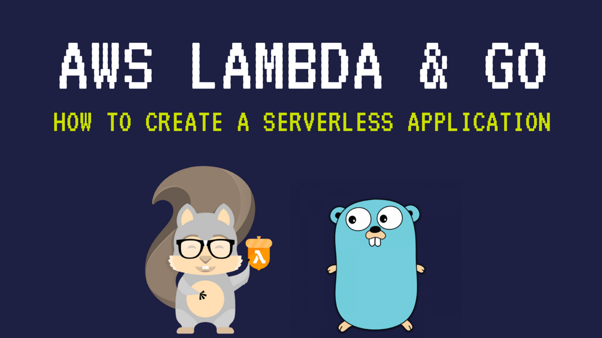
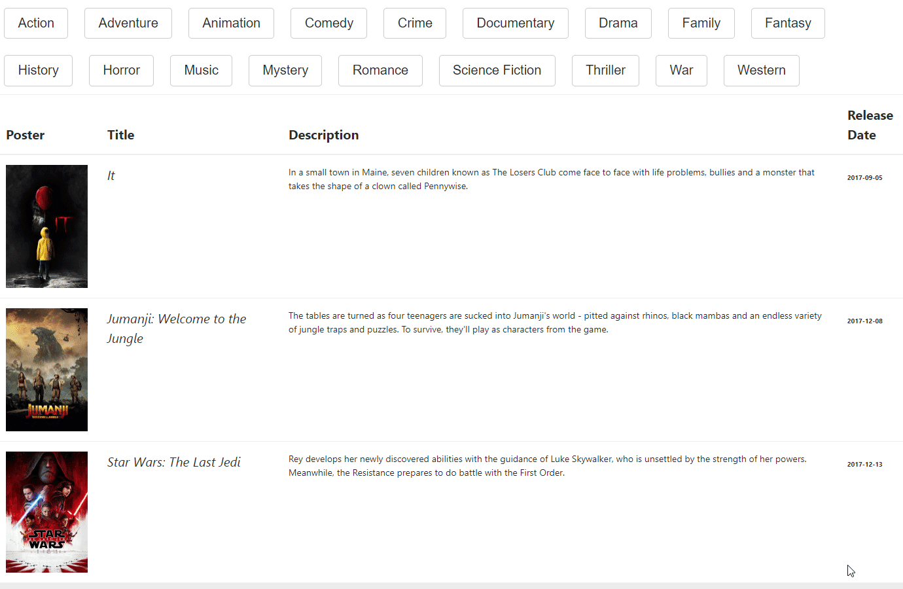

  

## Serverless Golang Function to Discover Movies - [Demo](http://discover-movies.s3-website-us-east-1.amazonaws.com)

  

## How to use

[Serverless Golang API with AWS Lambda](https://medium.com/@mlabouardy/serverless-golang-api-with-aws-lambda-34e442385a6a)

## License

MIT - Mohamed Labouardy
